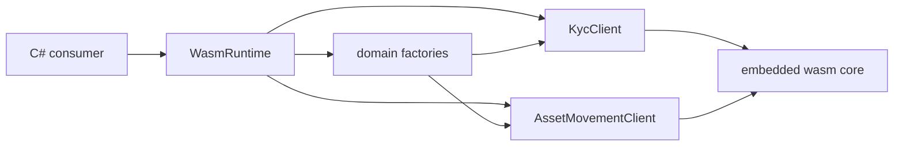

# Architecture

## Abstract

This page states how the types of `KeetaNet.Anchor` collaborate on one consumer path. It holds the type-boundary graph and the interaction path that no single source file can show.

## Purpose

An engineer reads this page to learn how a C# caller moves through `WasmRuntime`, domain factories, and the networked clients. After reading, the engineer can name the type that owns each step and the key symbol at that step.

## Collaboration graph

`Sdk.Name` in `src/KeetaNet.Anchor/Sdk.cs` is `KeetaNet.Anchor`. Product code lives under `src/`. The companion package `KeetaNet.Anchor.Extensions.DependencyInjection` registers the shared runtime.

The arrows follow the runtime path a consumer uses. The caller loads one `WasmRuntime`. That runtime exposes domain factories and creates `KycClient` and `AssetMovementClient`. Those types drive the embedded wasm core.

## How the types interact

A consumer walk through KYC and asset movement follows this path.

1. `WasmRuntime` in `src/KeetaNet.Anchor/Interop/WasmRuntime.cs` accepts the consumer through `Load`.
2. `WasmRuntime` in `src/KeetaNet.Anchor/Interop/WasmRuntime.cs` constructs domain factories, of which `Accounts` is the named symbol.
3. `AccountFactory` in `src/KeetaNet.Anchor/Crypto/AccountFactory.cs` creates a signer through `FromSeed`.
4. `WasmRuntime` in `src/KeetaNet.Anchor/Interop/WasmRuntime.Surface.cs` builds a KYC client through `CreateKycClient`.
5. `KycClient` in `src/KeetaNet.Anchor/Services/Kyc/KycClient.cs` discovers providers through `GetProviders`.
6. `WasmRuntime` in `src/KeetaNet.Anchor/Interop/WasmRuntime.Surface.cs` builds an asset-movement client through `CreateAssetMovementClient`.
7. `AssetMovementClient` in `src/KeetaNet.Anchor/Services/AssetMovement/AssetMovementClient.cs` discovers providers through `GetProviders`.
8. `WasmDispatcher` in `src/KeetaNet.Anchor/Interop/WasmDispatcher.cs` serializes each guest call through `Run`.

## Contracts that span types

These contracts bind more than one type.

| Contract | Home |
| --- | --- |
| Package identity is `KeetaNet.Anchor` | `Sdk.Name` in `src/KeetaNet.Anchor/Sdk.cs` |
| Consumer entry is `WasmRuntime.Load` | `src/KeetaNet.Anchor/Interop/WasmRuntime.cs` |
| Domain factories and networked clients are reached through `WasmRuntime` | `src/KeetaNet.Anchor/Interop/WasmRuntime.Surface.cs` |
| Dependency injection registers the shared runtime through `AddKeetaNetAnchor` | `KeetaNetAnchorServiceCollectionExtensions` in `src/KeetaNet.Anchor.Extensions.DependencyInjection/KeetaNetAnchorServiceCollectionExtensions.cs` |
| Tests under `tests/` are the usage source of truth for examples | `tests/KeetaNet.Anchor.Tests`, `tests/KeetaNet.Anchor.E2eTests` |
| Make owns build and test (`make developer`, `make build`, `make test`, `make do-lint`, `make pack`, `make wasm`, `make node-harness`) | repository `Makefile` |
