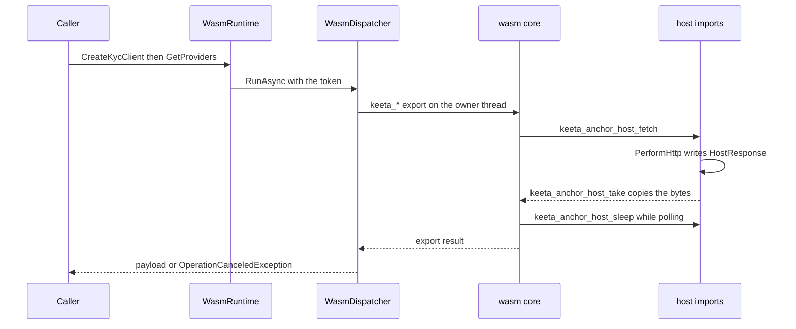
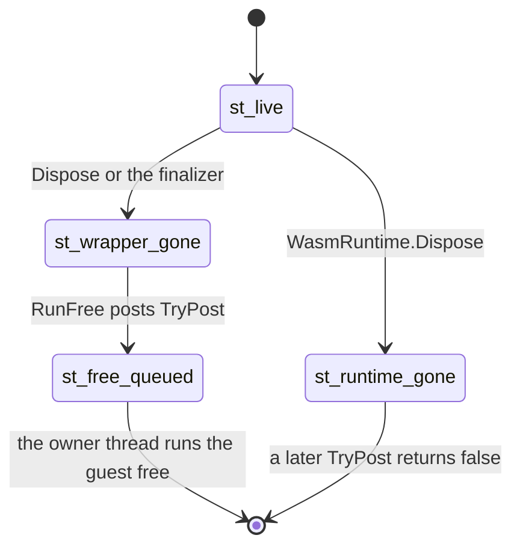
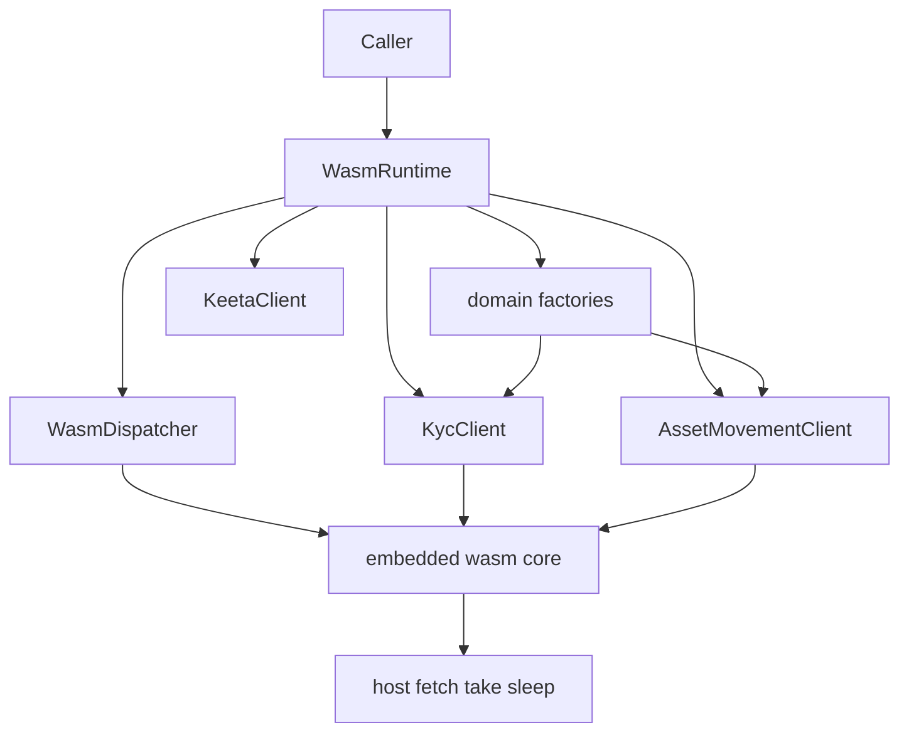

# Architecture

## Abstract

This page is the internal design of `KeetaNet.Anchor`. The package hosts a `wasm32-wasip1` core inside a .NET process. It states which decisions the host keeps and which ones the guest keeps.

## Purpose

An engineer reads this page before changing host imports, dispatcher ownership, wrapper disposal, or runtime registration. After reading, the engineer can name the decision that each constraint protects and the failure that follows when the constraint is removed.

## The host and the guest

`WasmRuntime` in `src/KeetaNet.Anchor/Interop/WasmRuntime.cs` loads the P1 module and satisfies the imports the guest cannot perform in a sandbox. `Load` reads the embedded resource `KeetaNet.Anchor.keetanetwork_anchor_client_wasi.wasm`. `Load(string)` reads a filesystem path. The split between host and guest is the load-bearing part of this package.

| Decision | Owner |
| --- | --- |
| KYC, asset movement, certificates, containers, and account key material | The guest module, reached through `keeta_*` exports |
| HTTP and the sleeps that pace guest retries | This host, through `keeta_anchor_host_fetch`, `keeta_anchor_host_take`, and `keeta_anchor_host_sleep` on `keeta:anchor/host` |
| How a C# caller reaches those domains | This host, through the factories and creation methods on `WasmRuntime` in `src/KeetaNet.Anchor/Interop/WasmRuntime.Surface.cs` |
| Guest linear memory and object handles | The guest allocator. The host copies bytes in and out |

The guest always completes a host import. `PerformHttp` in `src/KeetaNet.Anchor/Interop/WasmRuntime.cs` turns success, transport failure, and cancellation into a `HostResponse`. A canceled fetch becomes status `400` so the guest retry loop stops. An exception that left the import would leave the `Wasmtime.Store` mid-call.

After the guest export returns, `WasmRuntime.RunAsync` raises `OperationCanceledException` when the caller's token is canceled. The C# caller therefore sees cancel. The guest still saw a finished host import. `tests/KeetaNet.Anchor.Tests/ConcurrencyTests.cs` encodes both layers.

`HostSleep` waits on the active token when the token can cancel. A cancel wakes the sleep before the requested delay ends.

## One owner thread

A `Wasmtime.Store` accepts calls from one thread. `WasmDispatcher` in `src/KeetaNet.Anchor/Interop/WasmDispatcher.cs` is that thread. Its name is `keetanet-anchor-wasm`. Construction of `Engine`, `Module`, `Linker`, `Store`, and `Instance` runs on it. Every later `keeta_*` call joins the same queue.

| Constraint | Rejected default | Why |
| --- | --- | --- |
| One owner thread serializes every guest call | Callers touch the `Store` on their own threads | The Store is thread-affine. Two callers would corrupt guest memory |
| Local work blocks in `WasmDispatcher.Run` | Every public method is async | Crypto and certificate exports are synchronous in the guest and in the public API |
| Networked work uses `WasmDispatcher.RunAsync` and a `CancellationToken` | The caller thread blocks in the guest poll loop | The guest owns control flow between host imports. The host honors the token before dequeue and during HTTP and sleep |
| `RunAsync` refuses a caller that is already on the owner thread | Re-enter `Run` from that thread | The owner would wait for a queue job that it can never dequeue |

The host response buffer `_pending` is single-flight because the owner thread runs one guest call at a time. `tests/KeetaNet.Anchor.Tests/ConcurrencyTests.cs` signs from thread-pool threads against one `Account` and gets the same public key and the same verify result.

## Wrappers and the runtime

`WasmObject` in `src/KeetaNet.Anchor/WasmObject.cs` is a managed wrapper over a handle the guest issued. `Account`, `KycClient`, and `AssetMovementClient` are `WasmObject` types. `Dispose` and the finalizer both call `Release`, which reaches `WasmRuntime.RunFree`. `RunFree` posts `FreeQuietly` through `WasmDispatcher.TryPost`.

`KeetaClient` and `UserClient` are `IDisposable` and are not `WasmObject`. They own node HTTP state. `CreateKeetaClient` borrows an injected `HttpClient` and does not dispose it. Absent one, `KeetaClient` owns its own. `UserClient` borrows the signer and the operating account.

| Decision | Alternative rejected | Why |
| --- | --- | --- |
| Queue a handle free through `TryPost` | Call `keeta_*_free` on the finalizer thread | [CONTRIBUTING](../CONTRIBUTING.md) forbids a finalizer that touches the `Store`. `TryPost` never blocks and never throws |
| Dispose every wrapper before its `WasmRuntime` | Let wrappers outlive `WasmRuntime.Dispose` | `EnsureUsable` rejects work after the Store is gone. A free that races teardown is swallowed by `FreeQuietly` |
| `AddKeetaNetAnchor` registers one singleton | A new `WasmRuntime.Load` on every resolve | Each load starts a Store and an owner thread. `TryAddSingleton` in `src/KeetaNet.Anchor.Extensions.DependencyInjection/KeetaNetAnchorServiceCollectionExtensions.cs` keeps one instance the container disposes |
| `AddKeetaNetAnchorKeetaClient` supplies a typed `HttpClient` | `KeetaClient` always constructs `new HttpClient()` | The factory client uses pooled handlers. `CreateKeetaClient` then borrows that instance |

`tests/KeetaNet.Anchor.Tests/LifecycleTests.cs` disposes a wrapper twice, disposes the runtime before a wrapper, and collects a forgotten `Account` so the finalizer backstop can free the handle. `tests/KeetaNet.Anchor.Tests/DependencyInjectionTests.cs` resolves the same runtime twice and observes `IsDisposed` after the container closes.

## How a caller creates work

`WasmRuntime` in `src/KeetaNet.Anchor/Interop/WasmRuntime.Surface.cs` is the creation surface. Domain factories such as `Accounts` return handle-backed `WasmObject` instances. `CreateKycClient` and `CreateAssetMovementClient` bind a signer and a metadata root. Discovery, signing, retries, and polling for those two clients run inside the guest.

`CreateKeetaClient` and `CreateUserClient` talk to the node OpenAPI transport on the host. They use the runtime for blocks and accounts. They do not wrap a guest client handle. A `KeetaClient` without a bound network stays read-only. `UserClient` without a signer rejects writes with `SIGNER_REQUIRED`.

`AddKeetaNetAnchor` also registers `Accounts`, `Certificates`, `KycCertificates`, `Containers`, and `Sharables` as singletons that resolve from the shared runtime. [Quickstart](QUICKSTART.md) holds the fenced first-use calls.

## The embedded core

`make wasm` runs `scripts/build-wasm.sh`. That script downloads the pinned `keetanetwork-anchor-client-wasi` crate, builds `wasm32-wasip1`, and writes `src/KeetaNet.Anchor/wasm/keetanetwork_anchor_client_wasi.wasm`. `KeetaNet.Anchor.csproj` embeds that file as `KeetaNet.Anchor.keetanetwork_anchor_client_wasi.wasm`. `EnsureWasmCorePresent` fails the build when the file is missing.

A NuGet consumer therefore constructs `WasmRuntime` without Rust. Rust and the `wasm32-wasip1` target belong to `make wasm` only. The Makefile owns `developer`, `build`, `test`, `do-lint`, `pack`, `wasm`, and `node-harness`.

## Invariants

Each invariant below spans more than one file, which puts it beyond the reach of any single source comment.

| Invariant | Enforced at | Failure it prevents |
| --- | --- | --- |
| Guest state is touched only on the owner thread | `EnsureUsable` in `src/KeetaNet.Anchor/Interop/WasmRuntime.cs` and `WasmDispatcher.IsCurrentThread` | A second thread uses the `Store` and corrupts guest memory |
| A canceled or failed host fetch still returns a `HostResponse` | `PerformHttp` in `src/KeetaNet.Anchor/Interop/WasmRuntime.cs` | An exception unwinds through a host import and leaves the guest mid-call |
| A forgotten wrapper still frees its guest handle | The `WasmObject` finalizer queues `RunFree` through `TryPost` | A leaked handle stays allocated inside the guest until the runtime dies |
| `AddKeetaNetAnchor` shares one `WasmRuntime` | `TryAddSingleton` in `src/KeetaNet.Anchor.Extensions.DependencyInjection/KeetaNetAnchorServiceCollectionExtensions.cs` | Two loads create two Stores and two owner threads for one container |
| The published package embeds the wasm core | The `EmbeddedResource` in `src/KeetaNet.Anchor/KeetaNet.Anchor.csproj`, produced by `make wasm` | A NuGet consumer needs Rust and a crates.io fetch to construct `WasmRuntime` |

## Collaboration

Inbound: a C# caller or `AddKeetaNetAnchor` constructs `WasmRuntime` through `Load`. `AddKeetaNetAnchorKeetaClient` then asks `IHttpClientFactory` for the `HttpClient` that `CreateKeetaClient` borrows. Tests under `tests/KeetaNet.Anchor.Tests` and `tests/KeetaNet.Anchor.E2eTests` take the same `Load` path.

Outbound: the guest calls the three host imports for HTTP and sleep. The host satisfies those with `HttpClient` and `HostSleep`. `scripts/build-wasm.sh` produces the module that the assembly embeds. The e2e suite drives the reference TypeScript anchor through `tests/node-harness`, which [Quickstart](QUICKSTART.md) states as the Packages gate.
